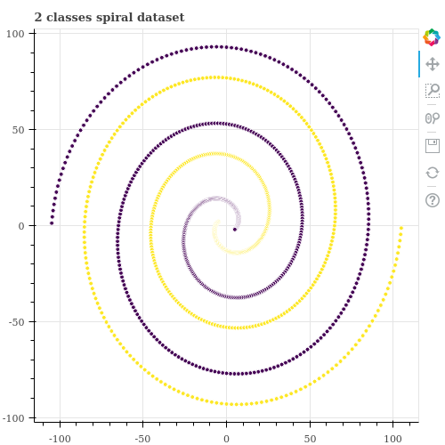
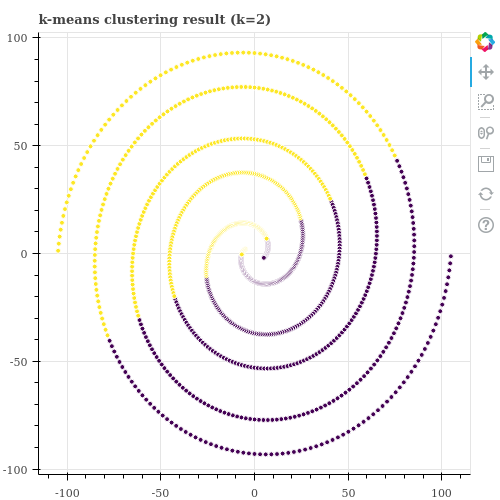
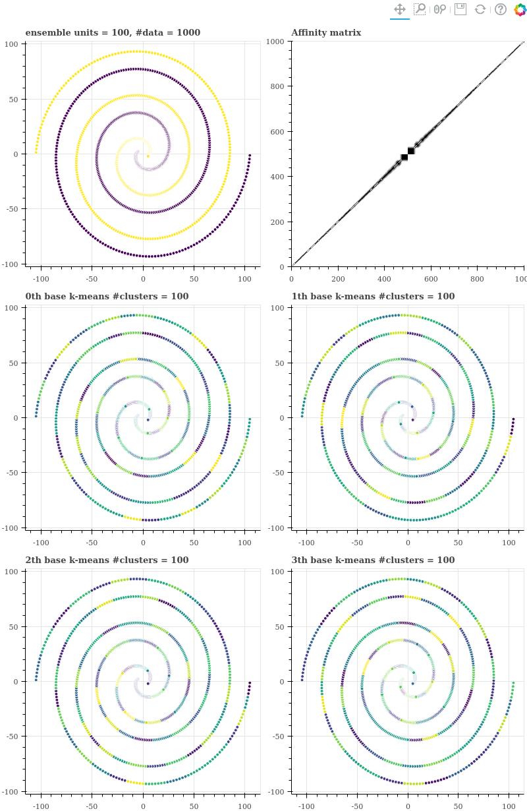
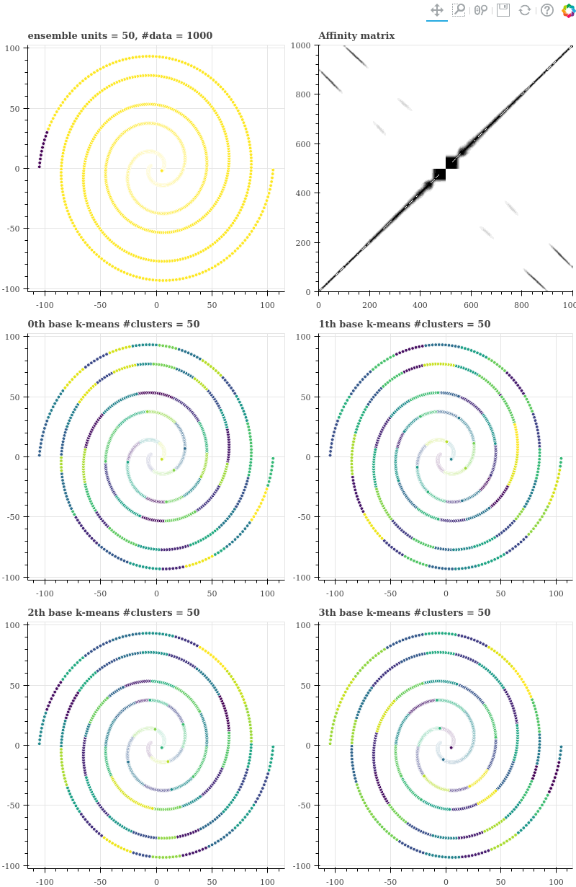
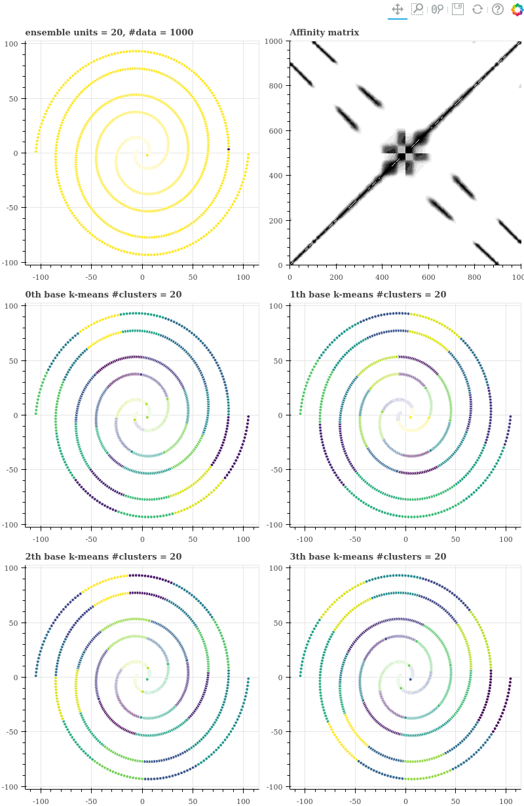
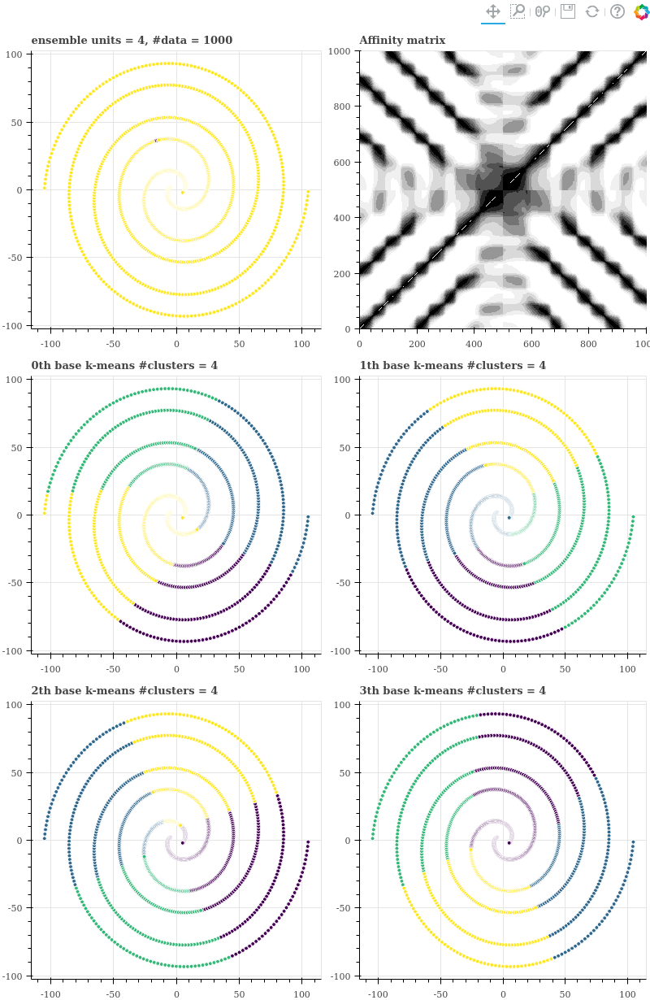

# k-means Ensemble Python package & tutorials

이 튜토리얼은 bokeh 와 scikit-learn 을 이용합니다. IPython notebook 파일과 bokeh images 는 tutorials 폴더 안에 있습니다.

Tutorials 에서는 간단히 만든 two class spiral dataset 을 이용합니다.

## Requirements

- bokeh >= 1.0.2
- scikit-learn >= 0.20.1

## Tutorials

k-means clustering 은 각 군집이 linearly separable 하거나, 군집의 모양이 구 형태로 convex 할 때 작동하며, 데이터 분포가 복잡할 경우에는 잘 작동하지 않는다 알려져 있습니다.

아래는 원점 근방에서 시작하며 서로 위상이 180 도 만큼 다른 두 개의 나선으로 이뤄진 데이터입니다. 우리는 아래의 그림에서 두 데이터가 보라색과 검정색으로 나뉘어지길 원하지만 k-means 는 나선형 데이터처럼 분포가 복잡한 (군집의 모양이 convex 가 아닌) 경우에는 잘 작동하지 않습니다.

```python
from bokeh.plotting import figure, output_notebook, output_file, reset_output, save, show
from bokeh.io import export_png
from data import generate_twin_spiral_data
from plot import draw_scatterplot

X, y = generate_twin_spiral_data()
p = draw_scatterplot(X, y, title='2 classes spiral dataset', width=500, height=500)
```



scikit-learn 을 이용하여 데이터를 두 개의 군집으로 나누면 아래처럼 공간을 이분 (bipartite) 하는 군집화 결과가 학습됩니다.

```python
from sklearn.cluster import KMeans

kmeans = KMeans(n_clusters=2, n_init=1, max_iter=10)
label = kmeans.fit_predict(X)
p = draw_scatterplot(X, label, title='k-means clustering result (k=2)', width=500, height=500)
export_png(p, 'kmeans_ensemble_kmeansresult.png')
```



이처럼 분포가 복잡한 데이터를 군집화 하기 위해 Spectral Clustering 과 같은 방법이 제안되기도 했지만, 이 역시 parameter setting 을 잘 설정해주지 않으면 군집화가 잘 되지 않습니다.

Kernerl k-means 역시 parameter 에 민감합니다. 어떠한 kernel function 을 이용할 것인지에 따라 데이터 간의 affinity 정의가 달라져 최종 군집화 결과가 다르게 학습될 수 있습니다.


```python
from sklearn.cluster import SpectralClustering

spectral_clustering = SpectralClustering(n_clusters=2)
labels = spectral_clustering.fit_predict(X)
p = draw_scatterplot(X, label, title='Spectral clustering result (k=2)', width=500, height=500)
export_png(p, 'kmeans_ensemble_scresult.png')
```


이러한 문제의 해법으로 제안된 것 중 하나는 clustering ensemble 입니다. Ensemble 과정에서는 어떠한 군집화 알고리즘을 이용하여도 좋습니다 없습니다. 

학습 속도가 빠른 k-means 를 이용하여 앙상블을 할 수도 있습니다. 한 번의 k-means 의 학습 결과 각 점들의 군집 아이디 (labels) 를 얻을 수 있습니다. 군집 아이디를 기준으로, 같은 군집에 속한 점들 간에 co-occurrence 를 계산합니다. k-means 를 100 번 학습하면 어떤 두 점은 최대 100 번의 co-occurrence 를 얻을 수 있고, 어떤 점은 한 번도 같은 군집에 속한 적이 없을 수도 있습니다. 이 co-occurrence 값을 점들 간의 affinity 로 이용합니다.

점들 간의 pairwise similarity (affinity) 를 알기 때문에 이를 이용하여 agglomerative hierarchical clustering 을 수행합니다. 군집의 개수가 k 가 될때까지 작은 군집들을 병합하면 됩니다.

정리하면 k-means ensemble 은 여러 번의 k-means 학습 결과를 통하여 점들 간의 co-occurrence 를 학습하고, 이를 affinity matrix 로 이용하여 agglomerative clustering 을 수행합니다. 간단한 방법이지만 많은 효과적으로 작동합니다. 또한 parameter setting 에 대한 기준도 어느 정도 명확합니다. Kernel k-means 를 이용하려면 데이터 분포에 적합한 kernel 을 사용자가 직접 정해야 하는 어려움도 있습니다. 그보다는 ensembles 을 위하여 이용되는 parameters 를 설정하는 기준이 명확합니다. 단, 계산 비용이 싸지는 않습니다. 대체로 ensemble 을 위해 학습하는 k-means 의 반복 횟수가 많기 때문입니다.

이 과정을 KMeansEnsemble 에 구현하였습니다. Parameter 는 다음과 같습니다.

```
n_clusters : 최종적으로 학습하고 싶은 군집의 개수
n_ensembles : 기본 k-means 의 반복 학습 횟수
n_ensemble_units (n_units) : 기본 k-means 학습 시의 k 값
```

Verbose mode 이기 때문에 1000 번의 k-means 반복 계산의 과정과 agglomerative clustering 의 status 가 출력됩니다.


```python
import sys
sys.path.append('../')
from kmeans_ensemble import KMeansEnsemble

n_clusters = 2
n_ensembles = 1000
n_units = 100
n_data = X.shape[0]

kmeans_ensemble = KMeansEnsemble(n_clusters, n_ensembles, n_units)
labels = kmeans_ensemble.fit_predict(X)
```

Out
```
Iteration 1000 / 1000 was done
Agglomerative clustering iters = 998 was done
```

Sparsity 도 계산할 수 있습니다. 같은 점들 간에는 co-occurrence 를 계산하지 않았기 때문에 이 개수인 `n_data` 를 추가하였습니다. 그래도 97.1 % 의 pairs 은 co-occurrence 가 없습니다. 왠만한 점들은 서로 유사도가 가지지 않는다는 의미입니다.

```python
nnz = kmeans_ensemble.affinity.nnz
sparsity = 1 - ((n_data + nnz) / (n_data ** 2))
print('sparsity of affinity = {:.4}'.format(sparsity))
```

Out
```
sparsity of affinity = 0.9709
```

우리는 parameter 를 다양하게 하여 실험을 할 것이기 때문에 그림을 그리는 부분을 함수로 만듭니다. (3, 2) 크기의 grid plots 을 그립니다. 좌측 첫 줄을 (0, 0) 이라 할 때, (0, 0) 은 k-means ensemble 을 통하여 학습한 두 개의 군집화 결과 입니다. (0, 1) 은 k-means 의 반복 학습으로부터 얻은 co-occurrence matrix 입니다. 그 아래 (1, 0) ~ (2, 1) 까지의 네 개의 그림은 기본 k-means clustering 에서의 결과를 시각화 한 것입니다.

함수를 이용하여 grid plot 을 그리고 이를 png 파일과 html 로 저장합니다.


```python
from bokeh.layouts import gridplot

def draw_debug_plots(X, kmeans_ensemble, labels, size=400):
    n_data= X.shape[0]

    title = 'ensemble units = {}, #data = {}'.format(n_units, X.shape[0])
    p0 = draw_scatterplot(X, labels, title, width=size, height=size)

    p1 = figure(title = 'Affinity matrix',
             x_range=(0, n_data),
             y_range=(0, n_data),
             width=size, height=size
         )
    p1.image([n_ensembles - kmeans_ensemble.affinity.todense()], x=0, y=0, dw=n_data, dh=n_data)

    gp = [p0, p1]
    for i in range(4):
        title = '{}th base k-means #clusters = {}'.format(i, n_units)
        p = draw_scatterplot(X, kmeans_ensemble.base_history[i], title, width=size, height=size)
        gp.append(p)
    gp = gridplot([[gp[0], gp[1]], [gp[2], gp[3]], [gp[4], gp[5]]])

    return gp

gp = draw_debug_plots(X, kmeans_ensemble, labels)

header = 'kmeans_ensemble_dataset_units{}'.format(n_units)
export_png(gp, header + '.png')
output_file(header + '.html')
save(gp)
reset_output()
```

기본 k-means 학습 시 데이터의 개수 1000 개에 군집의 개수 100 개를 이용하였기 때문에 (1, 0) 에서는 매우 작은 영역의 점들끼리만 같은 색으로 표현되어 있습니다. 데이터의 index 는 검은색 점들은 원점에 가장 가까운 점이 500 번이며, 원점에서 멀어질수록 1000 에 가까워집니다. 보라색 점들 중 가장 가까운 점의 index 가 499 이며, 원점에서 멀어질수록 0 에 가까워집니다. 즉 affinity matrix 에서 가운데가 원점이며, 모서리로 갈수록 원점에서 멀어지는 점들입니다.

Affinity matrix 를 살펴보면 색이 다른 두 점들 간에는 co-occurrence 가 전혀 없었으며, 매우 가까이 위치한 점들끼리만 co-occurrence 를 지닙니다. 그래서 대각선의 날카로운 선 모양의 그림이 그려집니다.




```python
n_units = 50

kmeans_ensemble = KMeansEnsemble(
    n_clusters=2, n_ensembles=1000,
    n_ensemble_units=n_units)
labels = kmeans_ensemble.fit_predict(X)

gp = draw_debug_plots(X, kmeans_ensemble, labels)

header = 'kmeans_ensemble_dataset_units{}'.format(n_units)
export_png(gp, header + '.png')
output_file(header + '.html')
save(gp)
reset_output()
```

Out
```
Iteration 1000 / 1000 was done
Agglomerative clustering iters = 998 was done
```

Units 의 개수가 100 일 때에는 97.1 % 의 sparsity 를 보였지만, units 의 개수가 줄어드니 affinity matrix 의 sparsity 가 작아집니다. 유사한 점들이 늘어갑니다.

```python
nnz = kmeans_ensemble.affinity.nnz
sparsity = 1 - ((n_data + nnz) / (n_data ** 2))
print('sparsity of affinity = {:.4}'.format(sparsity))
```

Out
```
sparsity of affinity = 0.9255
```

그런데 기본 k-means 를 학습할 때의 k 를 조금만 줄여도 서로 다른 색의 점들 간에 co-occurrence 가 생깁니다. 그래서 affinity matrix 에 반대 방향의 대각선이 듬성듬성 생깁니다. 이는 (2, 1) 그림에서 x range = (10, 30), y range = (-90, -70) 부분에 서로 다른 선 위의 점들이 같은 색 (같은 군집)을 할당 받았음을 통해 확인할 수 있습니다.

k-means 가 군집의 형태를 원형으로 가정하기 때문에 벌어진 현상입니다. 그리고 그 결과 군집화 결과는 엉망이 됩니다. Agglomerative clustering 의 input 에 노이즈가 있기 때문입니다 (Agglomerative clustering 은 greedy 한 방식으로 군집을 병합하기 때문에 노이즈에 매우 민감합니다)




```python
n_units = 20

kmeans_ensemble = KMeansEnsemble(
    n_clusters=2, n_ensembles=1000,
    n_ensemble_units=n_units)
labels = kmeans_ensemble.fit_predict(X)

gp = draw_debug_plots(X, kmeans_ensemble, labels)

header = 'kmeans_ensemble_dataset_units{}'.format(n_units)
export_png(gp, header + '.png')
output_file(header + '.html')
save(gp)
reset_output()
```

Out
```
Iteration 1000 / 1000 was done
Agglomerative clustering iters = 998 was done
```

Units 의 개수를 20 으로 줄이자 affinity matrix 의 sparsity 가 매우 많이 줄어듭니다.

```python
nnz = kmeans_ensemble.affinity.nnz
sparsity = 1 - ((n_data + nnz) / (n_data ** 2))
print('sparsity of affinity = {:.4}'.format(sparsity))
```

Out
```
sparsity of affinity = 0.7958
```

Units 의 개수를 좀 더 줄이면 affinity matrix 에 노이즈가 더 추가됩니다. 이미 ensemble 의 결과는 좋지 않기 때문에 굳이 비교하지는 않습니다.




```python
n_units = 4

kmeans_ensemble = KMeansEnsemble(
    n_clusters=2, n_ensembles=1000,
    n_ensemble_units=n_units)
labels = kmeans_ensemble.fit_predict(X)

gp = draw_debug_plots(X, kmeans_ensemble, labels)

header = 'kmeans_ensemble_dataset_units{}'.format(n_units)
export_png(gp, header + '.png')
output_file(header + '.html')
save(gp)
reset_output()
```

Out
```
Iteration 1000 / 1000 was done
Agglomerative clustering iters = 998 was done
```

이제는 co-occurrence 이 0 보다 큰 data point pairs 가 매우 많아졌습니다. 이는 units 을 작게 할 경우, 점들 간의 유사도를 잘 구분하지 못한다는 의미이기도 합니다.

```python
nnz = kmeans_ensemble.affinity.nnz
sparsity = 1 - ((n_data + nnz) / (n_data ** 2))
print('sparsity of affinity = {:.4}'.format(sparsity))
```

Out
```
sparsity of affinity = 0.2301
```

만약 units 의 개수를 4 처럼 매우 작게 설정한다면 affinity matrix 가 더 엉망이 됩니다.



즉 k-means ensemble 을 수행할 때에는 데이터의 개수와 비교하여 한 군집에 아주 작은 개수의 점들만이 할당되도록 해야합니다. 이는 마치 k-nearest neighbors 를 찾는 근사 방법과 같습니다. 그리고 affinity matrix 는 kernel matrix 역할을 합니다. 점들 간의 pairwise proximity 를 co-occurrence 로 정의한 것입니다. 우리가 반복 학습에 이용한 k-means 가 Euclidean distance 를 이용하도록 하였으므로, 이는 euclidean distance 에 기반하여 affinity 를 계산하는 RBF kernel k-means 의 근사 계산과 같습니다. 단 이를 위하여 (n, n) 크기의 kernel matrix 를 계산하지 않아도 되는 장점이 있습니다.

